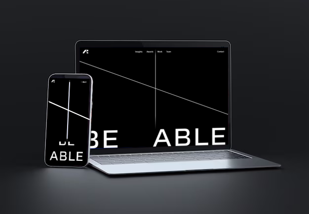
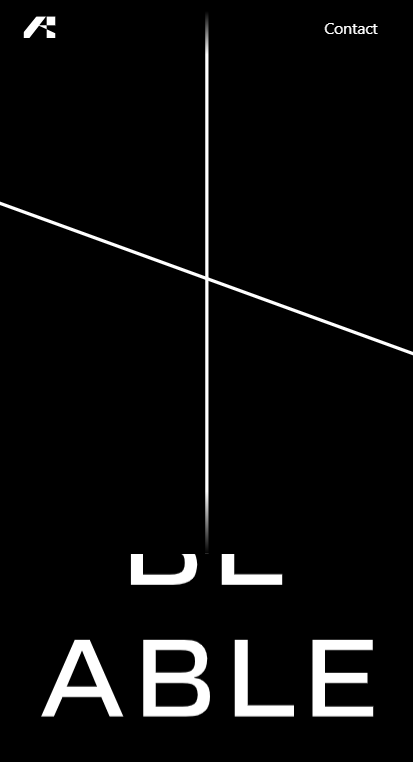
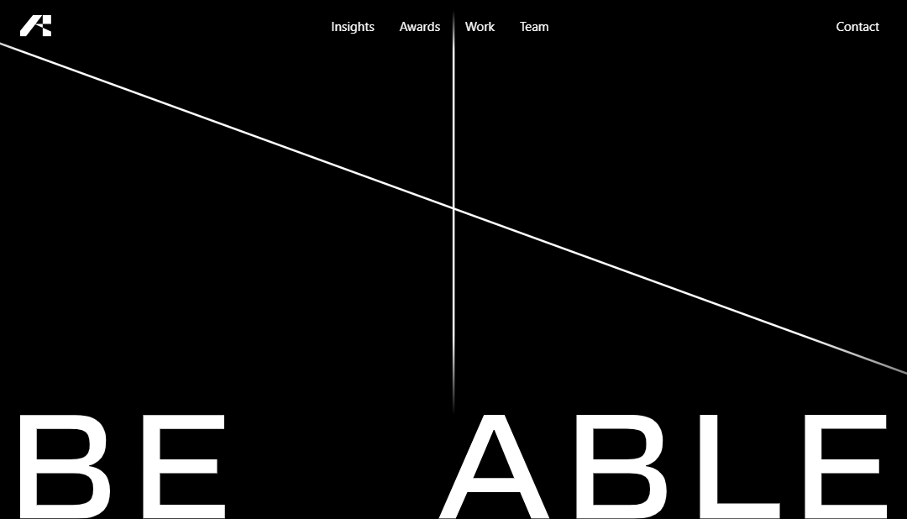

# [Live demo](https://waitforitthree.netlify.app)

# Stacked used

1.  HTML
2.  Tailwind CSS
3.  Javascript

# Screenshots

| Mobile                                | Desktop                                 |
| ------------------------------------- | --------------------------------------- |
|  |  |

# Highlights

1. Fully responsive design
2. Loading animation
3. Scroll-based animations

## Contact

If you have any suggestions or questions, you can email me at the address [a.elbazzazi.outlook.com](mailto:a.elbazzazi@outlook.com) or you can use the contact form on my [website](https://ayoubelbazzazi.vercel.app/Contact).

Best regards.
